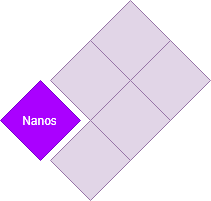

# Nanos    

Nanos is a library written in go. it helps you to build high concurrent choreographed monolithic system.

checkout the examples folder to know more.

##installiation
`$ go get -u "github.com/bashar-saleh/gonanos@v0.0.1"`